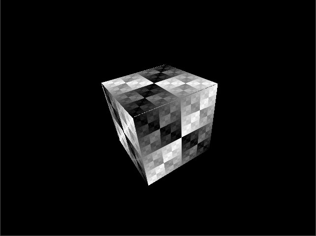
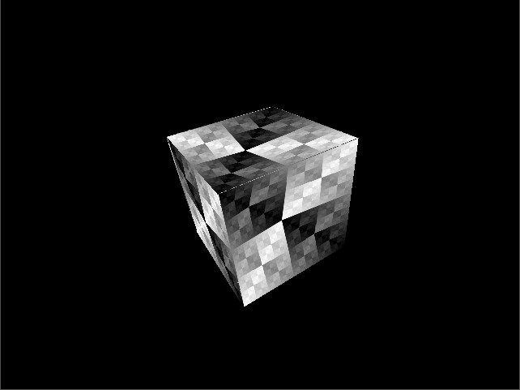
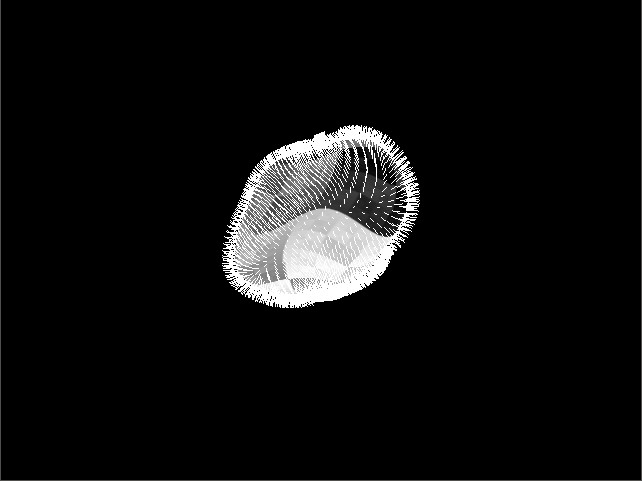
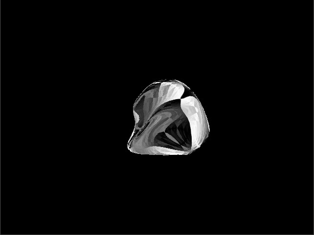

# Simple software rasterizer
This project uses shared Core project (via git submodules) - in case of offline project assembly, please manually sync the Core repository and paste files into the `core` folder.

## Description
Experiments with recreating graphics pipeline, rendering is performed via software rasterization, without using 3D graphics APIs, like OpenGL, D3D or Vulkan.

Implements:
* Sutherland-Hodgman triangle clipping
* Back-/front-face culling
* Depth buffer
* Vertex attributes: coordinates, normal, texture coordinates, color
* Perspective corrected rasterization
* Transformations stack (modelview and projection)
* Spherical Environment Mapping

Several debug switches present, see `render/source/drawer.cpp` (e.g. disable perspective correction, render normals as color, etc.).

## Screenshots
Simple rotating textured cube:

Simple rotating textured cube, without perspective correction:

Realtime deformed sphere mesh with normals:

Deformed sphere with Spherical Environment Mapping:

## License
Creative Commons Attribution-NonCommercial-ShareAlike 4.0 International Public License
